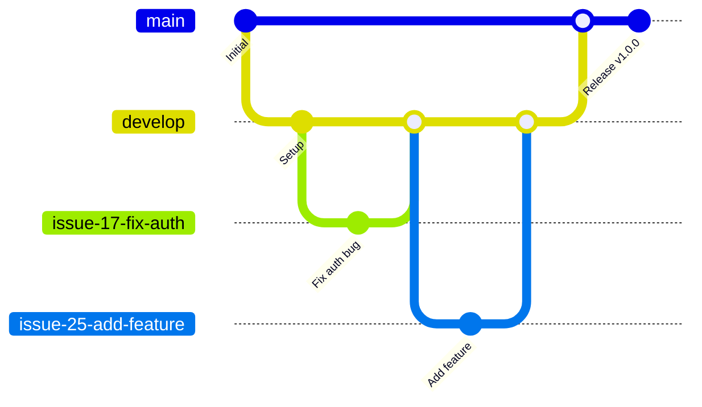

# Contributing Guidelines

We follow a **GitHub Projects-driven workflow** that combines issue tracking with visual project management for better team coordination and automated status tracking.

## 📋 Table of Contents

### Quick Start
- [Project Board Workflow](#project-board-workflow)
- [Branching Strategy](#branching-strategy)
- [Contribution Workflow](#contribution-workflow)

### Step-by-Step Guide
1. [Create an Issue](#1-create-an-issue)
2. [Add Issue to Sprint Board](#2-add-issue-to-sprint-board)
3. [Create Your Branch](#3-create-your-branch)
4. [Branch Naming Convention](#4-branch-naming-convention)
5. [Development and Commit Guidelines](#5-development-and-commit-guidelines)
6. [Pull Request Process](#6-pull-request-process)
7. [Automated Status Updates](#7-automated-status-updates)
8. [Changelog](#8-changelog)

### Emergency Procedures
- [Critical Production Fix Process](#critical-production-fix-process)
  - [Complete Critical Fix Workflow](#complete-critical-fix-workflow)
  - [Critical Fix Rollback Procedures](#critical-fix-rollback-procedures)
  - [Critical Fix Best Practices](#critical-fix-best-practices)

### Advanced Topics
- [Updating Issue-Based Branches](#updating-issue-based-branches)
- [Automated Release Process](#automated-release-process)
- [Code Standards](#code-standards)

### FAQ
- [Frequently Asked Questions](#frequently-asked-questions)

---

<a name="project-board-workflow"></a>
## 📊 Project Board Workflow

We use **GitHub Projects Sprint Board** for visual project management and automated workflow tracking.

### Sprint Board Columns
- **Backlog** - New issues waiting for planning
- **Ready** - Issues planned and ready to start
- **In Progress** - Currently being worked on
- **In Review** - Pull request created, waiting for review
- **Done** - Completed and merged to develop/main

### Automated Workflows
Our project board includes automated rules:
- **When pull request is merged to develop** → Set status to "Done" and close issue

<a name="branching-strategy"></a>
## 🌿 Branching Strategy

We follow a simplified **Issue-Driven Git Flow** for branch management:



### Main Branches
- **`main`** - Production branch
  - Contains only stable, released code
  - All releases are tagged here and deployed via CI/CD
  - Example: Version tags like `v1.2.0` are created on this branch

- **`develop`** - Integration branch
  - Contains the latest integrated features for the next release
  - May be unstable as new features are integrated
  - All issue-based branches merge here first

### Issue-Based Branches
All development work (features, bug fixes, and critical production fixes) uses issue-based branches:

- **Created via**: GitHub's issue branch creation feature only
- **Naming**: Auto-generated by GitHub (e.g., `17-fix-payment-gateway-crash`, `25-add-user-authentication`)
- **Branch from**:
  - `develop` for regular features and bug fixes
  - `main` for critical production fixes (labeled with `critical`)
- **Merge back to**:
  - `develop` for regular development work
  - `main` for critical fixes (then immediately sync to `develop`)
- **Benefits**:
  - Automatic issue linking and traceability
  - Consistent naming across all contributors
  - No manual branch naming errors

<a name="contribution-workflow"></a>
## 🔄 Contribution Workflow

### 1. Create an Issue
All work must begin with a GitHub Issue to track the problem or feature request.

**Note**: This repository uses minimal labeling - only the `critical` label is used for urgent production issues requiring hotfix process. All other issue classification (type, status, priority) is managed through issue templates and Project fields.

### 2. Add Issue to Sprint Board
**Before starting any work**, add the issue to the Sprint Board and fill in the planning fields:

#### Required Fields to Complete:
```
□ Priority: High/Medium/Low
□ Estimate: Expected effort in story points
□ Iteration: Target sprint/milestone
□ Start Date: When you plan to begin work
□ Assignee: Assign to yourself
```

#### Estimate Story Point Reference:
| Story Points | Typical Duration | Description                       |
| ------------ | ---------------- | --------------------------------- |
| 1            | 1-2 hours        | Very simple fix or change         |
| 2            | Half day         | Simple feature or bug fix         |
| 3            | 1 day            | Moderate complexity               |
| 5            | 2-3 days         | Complex feature                   |
| 8+           | 1+ week          | Very complex (consider splitting) |

#### Moving Issue to "In Progress":
1. Navigate to the Sprint Board
2. Drag the issue from "Ready" to "In Progress"
3. Ensure all required fields are filled
4. Now you can start development work

### 3. Create Your Branch
Create a branch using GitHub's issue integration:

**For all development work (features, bugs, critical fixes):**
1. Navigate to the relevant GitHub Issue
2. Click "Create a branch for this issue" in the Development section
3. **Important**: Choose the appropriate source branch:
   - **`develop`** for regular features and bug fixes
   - **`main`** for critical production fixes (issues labeled `critical`)
4. GitHub will auto-generate a descriptive branch name

**Manual branch creation (discouraged):**
```bash
# Only if GitHub branch creation is unavailable
# For regular development:
git checkout develop
git pull origin develop
git checkout -b 123-your-issue-description

# For critical production fixes:
git checkout main
git pull origin main
git checkout -b 456-critical-fix-description
```

### 4. Branch Naming Convention
**Required**: Always use GitHub's issue branch creation feature to ensure consistent naming.

When creating a branch from an issue:
1. Navigate to the relevant GitHub Issue
2. Click "Create a branch for this issue" in the Development section
3. **Important**: Choose the correct source branch:
   - **`develop`** for features and regular bug fixes
   - **`main`** for critical production fixes
4. GitHub will auto-generate a descriptive branch name like:
   - `3-add-login-page` (feature)
   - `17-fix-user-registration-bug` (bug fix)
   - `25-fix-critical-payment-gateway-crash` (critical fix)

This approach ensures:
- Consistent naming across all contributors
- Automatic linking between branches and issues
- Clear traceability of all work
- No manual naming errors or inconsistencies
- Complete audit trail through GitHub issues

### 5. Development and Commit Guidelines
We follow the [Conventional Commits](https://www.conventionalcommits.org/) format with **scope** for better organization:

#### Basic Format
```
<type>(<scope>): <description>
```

#### Types and Scopes

| Type        | Description                       | Example with Scope                              |
| ----------- | --------------------------------- | ----------------------------------------------- |
| `feat:`     | New feature                       | `feat(auth): add support for 2FA login`         |
| `fix:`      | Bug fix                           | `fix(ui): correct button alignment in settings` |
| `docs:`     | Documentation changes             | `docs(api): update authentication endpoints`    |
| `chore:`    | Maintenance, refactor, formatting | `chore(deps): update dependencies to latest`    |
| `refactor:` | Code refactoring                  | `refactor(db): optimize query performance`      |

#### Common Scopes
- `auth` - Authentication related
- `ui` - User interface
- `api` - API endpoints
- `db` - Database related
- `deps` - Dependencies
- `config` - Configuration
- `ci` - Continuous Integration
- `docs` - Documentation

#### Examples
```bash
# Feature with scope
git commit -m "feat(auth): implement OAuth2 integration with Google"

# Bug fix with scope
git commit -m "fix(payment): resolve timeout issue in gateway processing"

# Documentation with scope
git commit -m "docs(readme): add setup instructions for local development"

# Breaking change (note the !)
git commit -m "feat(api)!: change user endpoint response format"
```

**Important**: Issue closure is now handled automatically by GitHub Projects when PRs are merged. You no longer need to include `fixes #<issue_number>` in your commits.

### 6. Pull Request Process
- **Target branch**:
  - Regular features/bug fixes: merge to `develop`
  - Critical production fixes: merge to `main` (then immediately sync to `develop`)
- **Automated issue management**: Issues are automatically closed when PRs are merged via GitHub Projects automation
- **PR review**: Wait for required reviews and ensure all CI checks pass before merging
- **Automatic status updates**: Issue moves to "In Review" when PR is created, then to "Done" when merged

### 7. Automated Status Updates
When your PR is merged to `develop` or `main`:
- ✅ Issue automatically moves to "Done" column
- ✅ Issue status is set to completed and closed
- ✅ Sprint board reflects the completed work
- ✅ No manual status updates needed!

### 8. Changelog
Follow [Conventional Commits](https://www.conventionalcommits.org/) standards for commit messages to ensure changelogs can be generated automatically by Release Please.

<a name="critical-production-fix-process"></a>
## 🚨 Critical Production Fix Process

When a critical bug is discovered in production that requires immediate attention, follow this process to ensure safe and traceable emergency fixes.

### Complete Critical Fix Workflow:

#### 1. Create Critical Issue
1. Create a GitHub Issue documenting the critical problem
2. Add label: `critical`
3. Clearly describe the production impact and urgency

#### 2. Add to Sprint Board
1. Add the critical issue to the Sprint Board
2. Set Priority to "High"
3. Fill in Estimate (can be rough for urgent fixes)
4. Move to "In Progress"

#### 3. Create Branch from Main
1. Navigate to the critical issue
2. Click "Create a branch for this issue"
3. **Important**: Set source branch to `main` (not `develop`)
4. GitHub will create a branch like `123-fix-critical-payment-gateway-crash`

#### 4. Implement the Fix
```bash
# Work on your auto-generated issue branch
git checkout 123-fix-critical-payment-gateway-crash
git pull origin 123-fix-critical-payment-gateway-crash

# Make your changes - multiple commits are OK
git add .
git commit -m "fix(payment): resolve gateway timeout issue"

# Test thoroughly and make additional commits if needed
git commit -m "fix(payment): add additional error handling for edge cases"

# Push the branch
git push origin 123-fix-critical-payment-gateway-crash
```

#### 5. Create Pull Request to Main
- **Target**: `main` branch (not `develop`)
- **Review**: Even for urgent fixes, get a quick review if possible
- **Automatic linking**: The branch is automatically linked to the issue

#### 6. Deploy Critical Fix
```bash
# After PR is approved and merged to main
# The fix will be automatically deployed via CI/CD
# Issue automatically moves to "Done" and closes
```

#### 7. Sync to Develop Branch
**Critical**: After the critical fix is merged to `main`, immediately sync it to `develop`:

```bash
git checkout develop
git pull origin develop
git merge origin/main
git push origin develop
```

### Critical Fix Rollback Procedures

When a critical fix causes additional problems or needs to be reverted, choose the appropriate rollback method based on your situation:

#### Choosing the Right Rollback Method

| Situation                                | Method                          | Reason                           |
| ---------------------------------------- | ------------------------------- | -------------------------------- |
| Critical fix already merged and deployed | Option 1 (New Issue & Rollback) | Preserves complete git history   |
| Critical fix still in PR stage           | Option 2 (Branch Rollback)      | Clean restart is simpler         |
| Production critically broken             | Option 3 (Emergency Rollback)   | Immediate return to stable state |

#### Option 1: Rollback via New Critical Issue (Recommended)

**When to use**: The problematic critical fix has already been merged to `main` and deployed to production.

**Step-by-step example**:
```bash
# First, identify the problematic commit
git log --oneline main -5
# Output might show:
# a1b2c3d fix(payment): resolve gateway timeout
# e4f5g6h feat(ui): add new user dashboard
# ...

# 1. Create a new GitHub Issue for the rollback with 'critical' label
# 2. Add to Sprint Board with High priority
# 3. Create branch from the issue (source: main)
# 4. Use git revert to create a new commit that undoes the previous change

git checkout 456-rollback-payment-gateway-fix  # Your new issue branch
git revert a1b2c3d

# Push and create PR to main as usual
git push origin 456-rollback-payment-gateway-fix
```

#### Option 2: Branch-level Rollback

**When to use**: The critical fix branch still exists and has **NOT been merged** to `main` yet.

**Step-by-step example**:
```bash
# Close the original issue's PR and delete the branch
# Delete the problematic branch (local and remote)
git branch -D 123-problematic-payment-fix
git push origin --delete 123-problematic-payment-fix

# Create a new issue for the corrected approach
# Add to Sprint Board and implement the correct solution
```

#### Option 3: Emergency Production Rollback

**When to use**: The critical fix is deployed and causing severe production issues.

```bash
# 1. Create emergency rollback issue immediately with 'critical' label
# 2. Add to Sprint Board with High priority
# 3. Create branch from issue (source: main)
# 4. Identify the last known good commit on main
git log --oneline main

# 5. Revert the problematic commit
git checkout 789-emergency-rollback-payment-fix  # Your emergency issue branch
git revert <problematic-commit-hash>
git push origin 789-emergency-rollback-payment-fix

# 6. Fast-track the rollback PR and deploy immediately
```

### Critical Fix Best Practices

- **Always use issues**: Every critical fix must start with a GitHub Issue for proper tracking
- **Always use Sprint Board**: Add critical issues to the board for visibility
- **Always use GitHub branch creation**: Never manually name branches, even in emergencies
- **Document thoroughly**: Create clear commit messages explaining the problem and solution
- **Test on the branch**: Verify the fix works before merging
- **Multiple commits OK**: It's better to have several small, clear commits than one large messy one
- **Quick reviews**: Even urgent fixes benefit from a second pair of eyes
- **Monitor after deployment**: Watch for any side effects after the fix is deployed
- **Use labels**: Always label critical issues with `critical` for visibility

<a name="updating-issue-based-branches"></a>
## 🔄 Updating Issue-Based Branches

When the `develop` branch is updated (e.g., after a critical fix sync), existing issue-based branches should be updated to include the latest changes.

### When to Update Your Branch:
- After critical fix changes have been synced to `develop`
- When `develop` has significant updates that might affect your work
- Before creating a Pull Request (recommended)

### Method 1: Rebase (Recommended - Clean History)

```bash
# 1. Switch to your issue-based branch
git checkout your-branch-name

# 2. Ensure you have the latest develop changes
git fetch origin

# 3. Rebase your branch onto the latest develop
git rebase origin/develop

# 4. If conflicts occur, resolve them and continue
# git add .
# git rebase --continue

# 5. Force push (rebase changes history)
git push --force-with-lease origin your-branch-name
```

### Method 2: Merge (Alternative - Safer for Shared Branches)

```bash
# 1. Switch to your branch
git checkout your-branch-name

# 2. Merge the latest develop
git merge origin/develop

# 3. Push the updates
git push origin your-branch-name
```

### Choosing the Right Method:
- **Use Rebase** when:
  - Your branch hasn't been shared with others
  - You want to maintain a clean, linear history
  - Your branch doesn't have an active Pull Request yet

- **Use Merge** when:
  - Other team members are collaborating on the branch
  - The branch has an active Pull Request
  - You prefer to preserve the exact commit history

<a name="automated-release-process"></a>
## 🚀 Automated Release Process
We utilize `Release Please` (a GitHub Action) to automate versioning, changelog generation, and GitHub Releases. This process relies on adherence to the Conventional Commits specification.

### Configuration Files
The automated release process is configured via:
- `.release-please.yml` - Main configuration file defining release settings
- `.github/workflows/release-please.yml` - GitHub Action workflow that triggers the automation

### Release Workflow
The `main` branch is designated as our production/release branch, and releases are automatically created based on changes merged into it.

**Workflow for a New Release:**
1. **Develop Features/Bugfixes:** Continue to develop new features and bugfixes on issue-based branches, merging them into `develop` as per our branching strategy. Ensure your commit messages follow Conventional Commits format.
2. **Prepare for Release (Sync `develop` to `main`):**
   * Once `develop` branch is stable and ready for a release, create a Pull Request from `develop` to `main`.
   * The title and description of this PR can be concise, for example:
     ```
     Title: Merge develop into main for next release
     Description: This PR syncs the latest changes from the 'develop' branch to 'main' to initiate the release process via Release Please.
     ```
   * Review and merge this PR into `main`.
3. **Release Please Automation Trigger:** Merging `develop` to `main` will trigger the `release-please.yml` GitHub Action.
4. **Review the Automated Release PR:**
   * `Release Please` will automatically create a new Pull Request targeting the `main` branch (e.g., `chore(main): release 1.0.0+X`).
   * This PR will contain the automatically calculated version number and the generated `CHANGELOG.md` entries based on your Conventional Commits.
   * **Crucially, review this PR** to ensure the versioning and changelog are as expected.
5. **Finalize the Release:**
   * Merge the automated Release PR into `main`.
   * Once merged, Release Please automatically:
     * Creates a Git Tag (e.g., `v1.0.0+X`) on the `main` branch
     * Creates a corresponding GitHub Release with the generated changelog
6. **Sync `main` back to `develop`:**
   * After the release is finalized on `main`, manually merge the changes from `main` back into `develop` to ensure `develop` has the latest version number and `CHANGELOG.md` updates.
   * Use the following commands:
     ```bash
     git checkout develop
     git pull origin main --no-ff
     git push origin develop
     ```

<a name="code-standards"></a>
## 💡 Code Standards

### Code Quality Requirements

#### Linting and Analysis
- **Dart/Flutter projects**: Use `dart analyze` and `flutter analyze`
- **JavaScript/TypeScript**: Use ESLint with appropriate configuration
- **Python**: Use pylint, flake8, or black for formatting
- All linting warnings must be resolved before merging

#### Testing Requirements
- **Minimum test coverage**: 80% for new code
- **Unit tests**: Required for all business logic functions
- **Integration tests**: Required for API endpoints and critical user flows
- **Test naming**: Use descriptive names that explain what is being tested

#### Naming Conventions
- **Variables**: Use camelCase (JavaScript/Dart) or snake_case (Python)
- **Functions**: Use descriptive verbs (e.g., `getUserById`, `calculateTotalPrice`)
- **Classes**: Use PascalCase (e.g., `UserService`, `PaymentGateway`)
- **Files**: Use kebab-case for most files (e.g., `user-service.js`, `payment-gateway.dart`)
- **Constants**: Use UPPER_SNAKE_CASE (e.g., `MAX_RETRY_ATTEMPTS`)

#### Code Organization
- **Keep functions small**: Ideally under 20 lines, maximum 50 lines
- **Single responsibility**: Each function/class should have one clear purpose
- **Avoid deep nesting**: Maximum 3 levels of indentation
- **Use meaningful comments**: Explain why, not what
- **Remove dead code**: Delete unused functions, variables, and imports

#### Documentation Requirements
- **Public APIs**: Must have comprehensive documentation
- **Complex algorithms**: Include explanation comments
- **Configuration files**: Document all options and their effects
- **README files**: Keep up-to-date with current setup instructions

#### Security Best Practices
- **Never commit secrets**: Use environment variables or secure vaults
- **Input validation**: Validate all user inputs
- **Error handling**: Don't expose internal details in error messages
- **Dependencies**: Keep dependencies updated and audit for vulnerabilities

#### Performance Guidelines
- **Database queries**: Optimize for minimal N+1 queries
- **API responses**: Keep response times under 200ms for most endpoints
- **Memory usage**: Avoid memory leaks, especially in long-running processes
- **Caching**: Implement appropriate caching strategies

<a name="frequently-asked-questions"></a>
## 🤔 Frequently Asked Questions

### Project Board and Sprint Management

**Q: What if I forget to fill in the Sprint Board fields before starting work?**
A: Please fill them in as soon as possible. These fields help with sprint planning and resource allocation. The issue won't be blocked, but it helps the team plan better.

**Q: Can I change the Estimate after starting work?**
A: Yes, estimates can be updated as you learn more about the task. This helps improve future estimation accuracy.

**Q: What if my work takes much longer than estimated?**
A: Update the estimate and communicate with your team. This feedback helps improve future sprint planning.

### General Workflow

**Q: Can I work on multiple issues at the same time?**
A: Yes, but create separate branches for each issue and move them to "In Progress" on the Sprint Board. This keeps changes isolated and makes reviews easier.

**Q: What if I accidentally commit to the wrong branch?**
A: You can use `git cherry-pick` to move commits to the correct branch, or create a new issue-based branch and start fresh.

**Q: Do I still need to include "fixes #123" in my commits?**
A: No! This is no longer required. GitHub Projects automation handles issue closure when PRs are merged to develop or main.

### Branching and Issues

**Q: What if GitHub's "Create a branch" button isn't available?**
A: This usually means you don't have write access to the repository. Contact a repository maintainer for permissions.

**Q: Can I rename a branch after creating it?**
A: It's better to create a new issue-based branch instead. This maintains the automatic linking between issues and branches.

**Q: What if I need to work on something that doesn't have an issue?**
A: Always create an issue first, then add it to the Sprint Board. This ensures proper tracking and follows our workflow consistently.

### Commit Messages

**Q: How specific should commit scopes be?**
A: Use the most specific scope that makes sense. For example, `feat(auth/2fa)` if you have sub-modules, or just `feat(auth)` for general authentication work.

**Q: Can I have multiple types in one commit?**
A: No, each commit should have a single type. If you're doing multiple things, consider breaking them into separate commits.

### Critical Fixes

**Q: How do I know if something is "critical" enough for the emergency process?**
A: If it's causing production downtime, data loss, security issues, or significantly impacting users, it's critical. When in doubt, discuss with your team lead.

**Q: Should I still add critical fixes to the Sprint Board?**
A: Yes, even critical fixes should be added to the Sprint Board for visibility and tracking, but with High priority.

### Release Process

**Q: What if Release Please creates the wrong version number?**
A: This usually happens due to incorrect commit message formatting. You can edit the automated PR before merging, or create a manual adjustment commit.

**Q: How often should we release?**
A: This depends on your team's needs. Many teams do weekly or bi-weekly releases, but you can release as often as daily or as infrequently as monthly.

### Code Standards

**Q: What if the linter conflicts with our existing code style?**
A: Update the linter configuration to match your team's agreed-upon style. Consistency is more important than any specific style choice.

**Q: How do I handle legacy code that doesn't meet current standards?**
A: Don't refactor everything at once. Improve code quality incrementally when you're working in those areas, following the "boy scout rule" - leave code better than you found it.

---

## 🎯 Quick Reference Card

### New Issue Workflow:
```
1. Create GitHub Issue (no labels needed except 'critical' for hotfixes)
2. Add to Sprint Board and fill fields:
   - Priority, Estimate, Iteration, Start Date
3. Move to "In Progress"
4. Click "Create a branch for this issue"
5. Develop and commit (NO need for fixes #123)
6. Create PR → Auto moves to "In Review"
7. Merge PR to develop → Auto moves to "Done" and closes issue
```

### Sprint Planning Checklist:
```
□ All issues have Priority set
□ All issues have Estimate (Story Points)
□ Issues assigned to team members
□ Sprint capacity vs. planned work reviewed
□ Dependencies identified
□ Definition of Done agreed upon
```

### Most Common Commands
```bash
# Create issue-based workflow
1. Create GitHub Issue (only add 'critical' label if hotfix needed)
2. Add to Sprint Board with required fields
3. Click "Create a branch for this issue"
4. git checkout <auto-generated-branch-name>
5. git commit -m "feat(scope): description" (NO fixes #123 needed)
6. git push origin <branch-name>
7. Create PR to develop

# Update branch with latest develop
git fetch origin
git rebase origin/develop
git push --force-with-lease origin <branch-name>

# Critical fix emergency workflow
1. Create issue with "critical" label
2. Add to Sprint Board with High priority
3. Branch from main (not develop)
4. Fix, test, PR to main
5. After merge: git checkout develop && git merge origin/main
```

### Commit Message Templates
```bash
# Regular feature (NO fixes #123 needed)
git commit -m "feat(scope): add new feature description"

# Bug fix (NO closes #456 needed)
git commit -m "fix(scope): resolve specific bug description"

# Breaking change
git commit -m "feat(scope)!: change that breaks API"
```

---

## 📈 Sprint Board Benefits

### For Developers:
- **Clear prioritization** - See what's most important to work on
- **Workload visibility** - Understand current team capacity
- **Automated tracking** - Focus on coding, not status updates
- **Better planning** - Estimate and track your own work using Story Points

### For Project Managers:
- **Real-time dashboard** - See project progress at a glance
- **Resource allocation** - Identify bottlenecks and redistribute work
- **Data-driven planning** - Use historical estimates for future sprints
- **Velocity tracking** - Monitor sprint progress and team velocity

### For Teams:
- **Improved coordination** - Everyone knows who's working on what
- **Reduced ceremonies** - Less time spent on status meetings
- **Better estimates** - Learn from completed work to improve planning
- **Automated reporting** - Generate reports from board data

---

Thank you for contributing! 🙏